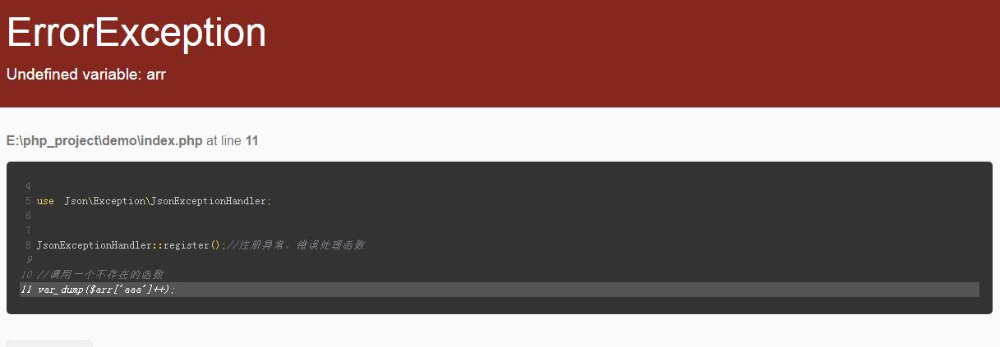

This is a project inspired by CodeIgniter4, and used for displaying exception and errors.

## screenshot



## Install

```shell
composer installl fanqingxuan/exception
```

## Usage

```php
<?php

require 'vendor/autoload.php';

use Json\Exception\JsonExceptionHandler;


JsonExceptionHandler::register();

var_dump($arr['aaa']++);
```

